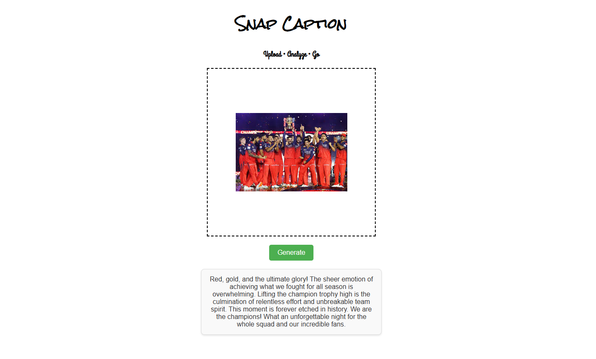

# 📸 AI Image Caption Generator (Gemini 2.5 Flash)

## 📖 Project Description

The **AI Image Caption Generator** is a web-based application that allows users to upload an image and instantly receive a **clear, meaningful, and human-like caption** generated using **Google Gemini 2.5 Flash API**.

This project leverages Gemini’s advanced **vision understanding capabilities** to analyze the content of an image—such as objects, actions, and scenes—and convert it into a natural language description.

The application uses **EJS (Embedded JavaScript Templates)** to render dynamic and responsive pages, ensuring a smooth and user-friendly experience. Users simply upload an image, and the AI processes it in real time to generate an accurate caption within seconds.

The **Gemini 2.5 Flash model** is chosen because it offers:
- Fast and efficient image analysis  
- High-quality caption generation  
- Optimized performance for real-time applications  

This project is ideal for students and developers who want to understand how **AI vision models** can be integrated into real-world web applications for **education, accessibility, and content creation**.
